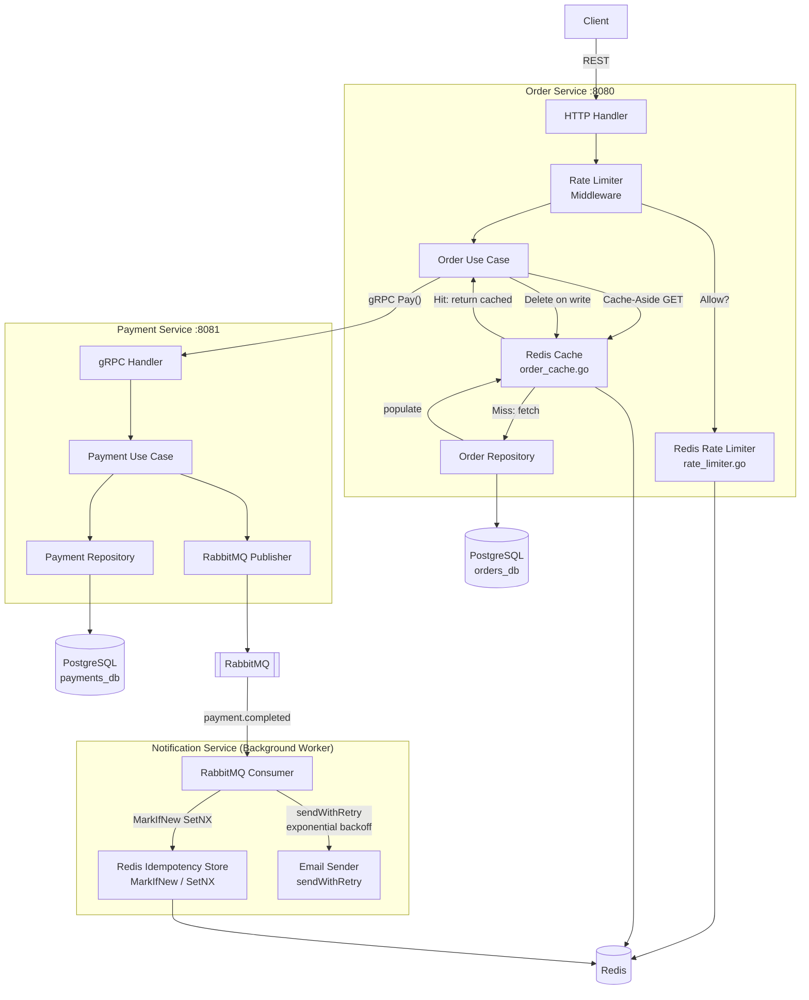

# Order and Payment Microservice System

A robust, decoupled microservice architecture built with **Go** following **Clean Architecture** principles. This project implements a reliable Order processing flow integrated with a Payment service.

## 🚀 Architecture Overview

The system consists of two independent microservices communicating over REST:

- **Order Service (Port 8080)**: Manages order lifecycles (Pending, Paid, Failed, Cancelled).
- **Payment Service (Port 8081)**: Processes authorizations and declines.



### Key Design Principles (Best-Case Design)
- **Thin Handlers**: Business logic and state transitions reside in the Use Case layer.
- **Dependency Injection**: Manual DI implemented at the Composition Root (`main.go`).
- **Interfaces (Ports)**: Decoupled repositories and outbound HTTP clients for testability.
- **Separate Bounded Contexts**: Each service owns its own database schema and repository implementation. No shared "models" package.

---

## 🗄 Caching — Invalidation Strategy

The Order Service uses a **Cache-Aside** (lazy-load) pattern backed by Redis.

| Operation | Cache behaviour |
| :--- | :--- |
| `GET /orders/:id` | Check Redis first (`order:<id>`). On a hit, return immediately. On a miss, read from PostgreSQL, write to Redis with a configurable TTL, then return. |
| `POST /orders` (create) | Order is written to PostgreSQL. After the payment round-trip the final status is committed and the key is **deleted** so the next read always fetches the authoritative row. |
| `DELETE /orders/:id` (cancel) | Status is updated in PostgreSQL, then the key is **deleted** immediately. |
| Payment failure / unavailable | Key is deleted before returning the error so a stale "Pending" entry is never served. |

**Why delete rather than update?** A write-through update and a DB commit are not atomic. Deleting the key on every write is simpler and guarantees the cache is never more authoritative than the database. The TTL is a safety net that evicts any key that was somehow missed.

**Rate-limiter keys** use a separate namespace (`rate_limit:<clientID>:<bucket>`) with a fixed-window TTL equal to the window duration. They are never manually invalidated; they expire automatically.

---

## 🔄 Background Jobs — Retry Logic

The **Notification Service** is a background worker that consumes `payment.completed` events from RabbitMQ. It uses two independent resilience mechanisms:

### 1. Idempotency (exactly-once delivery)

Before processing any event the consumer calls `MarkIfNew` which executes a Redis `SETNX` on the key `notif:<messageID>`. If the key already exists the event was already processed and the message is **ACK'd and skipped**. This prevents duplicate emails when RabbitMQ redelivers a message (e.g., after a consumer restart).

### 2. Exponential-backoff retry for email sending

`sendWithRetry` wraps the `EmailSender.Send` call in a loop with up to `maxAttempts` tries. The wait between consecutive failures doubles each time:

| Attempt | Wait before next try |
| :--- | :--- |
| 1 | 1 s |
| 2 | 2 s |
| 3 | 4 s |
| … | 2^(attempt-1) s |

If the context is cancelled (e.g., shutdown signal) the retry loop exits immediately and returns `ctx.Err()`. If all attempts are exhausted the message is **NACK'd without requeue** — RabbitMQ routes it to the dead-letter exchange for manual inspection rather than looping forever.

---

## 🛠 Business Rules & Requirements

### 1. Financial Accuracy
- All monetary values use `int64` (representing subunits like cents). Floating-point arithmetic (`float64`) is strictly avoided to prevent precision errors.

### 2. Order Invariants
- **Positive Amount**: Orders must have an amount > 0.
- **Non-Cancellable "Paid" Orders**: Once an order is marked as "Paid", it can no longer be "Cancelled".

### 3. Payment Limits
- **Authorization Limit**: Any payment exceeds **100,000 cents** (1,000 units) will be automatically **Declined** by the Payment Service.

### 4. Service Interaction & Resilience
- **Timeouts**: The Order Service uses a custom `http.Client` with a hard **2-second timeout** for all payment requests.
- **Error Handling**: 
  - If the Payment Service is unavailable or times out, the Order Service returns a **503 Service Unavailable** error.
  - The Order is marked as **Failed** in the database when the payment service call fails.
  - No hanging requests: The system fails fast to provide a better user experience.

---

## 🚦 Getting Started

### Prerequisites
- Go 1.25+
- PostgreSQL

### Database Setup
Both services use migrations to manage their schema. Initialize your PostgreSQL databases (default: `done_db` for Order and a separate one for Payment if configured).

### Running the Services

1. **Start Payment Service**:
   ```bash
   cd payment-service
   go run cmd/main.go
   ```

2. **Start Order Service**:
   ```bash
   cd order-service
   go run cmd/main.go
   ```

---

## 📡 API Endpoints

### Order Service (`localhost:8080`)
- `POST /orders`: Create a new order (triggers payment authorization).
- `GET /orders/:id`: Retrieve order details.
- `DELETE /orders/:id`: Cancel a pending order.

### Payment Service (`localhost:8081`)
- `POST /payments`: Process a payment (Internal call from Order Service).
- `GET /payments/:order_id`: Check payment status by Order ID.

---

## 🧪 Error Handling Logic

| Scenario | Response Status | Order Status |
| :--- | :--- | :--- |
| Payment Success | 200 OK | Paid |
| Payment Declined | 200 OK | Failed |
| Payment Service Down | **503 Service Unavailable** | Failed |
| Invalid Amount (<= 0) | 400 Bad Request | N/A |
| Cancel "Paid" Order | 409 Conflict | Paid |
